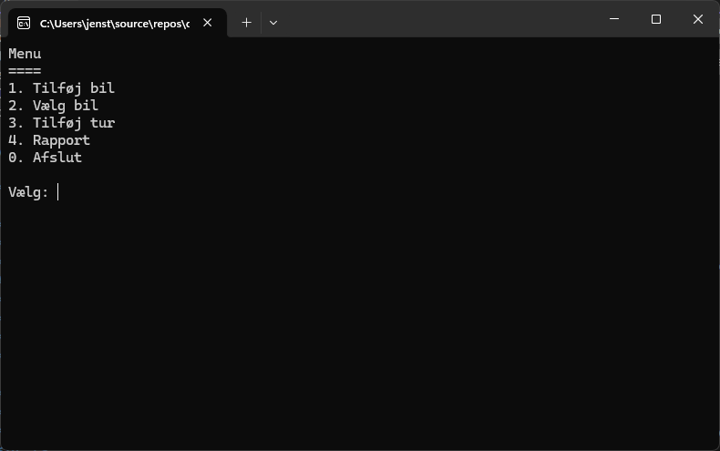

[![Contributors][contributors-shield]][contributors-url]
[![Forks][forks-shield]][forks-url]
[![Stargazers][stars-shield]][stars-url]
[![Issues][issues-shield]][issues-url]
[![MIT License][license-shield]][license-url]
[![LinkedIn][linkedin-shield]][linkedin-url]

<br />
<div align="center">
    <a href="https://github.com/TirsvadDatamatiker/CarApp">
        
    </a>
    <h3 align="center">CarApp</h3>
    <p align="center">
    A car application as assignment for the course "Datamatiker" at UCL
    <br />
    <br />
    <!-- PROJECT SCREENSHOTS -->
    <a href="https://github.com/TirsvadDatamatiker/CarApp/blob/master/images/screenshot01.png">
        
    </a>
    <br />
    <a href="https://github.com/TirsvadDatamatiker/CarApp"><strong>Explore the docs »</strong></a>
    <br />
    <br />
    <a href="https://github.com/TirsvadDatamatiker/CarApp/issues/new?labels=bug&template=bug-report---.md">Report Bug</a>
    ·
    <a href="https://github.com/TirsvadDatamatiker/CarApp/issues/new?labels=enhancement&template=feature-request---.md">Request Feature</a>
    </p>
</div>

# CarApp

A car application as assignment for the course "Datamatiker" at UCL

## Table of Contents


## Preparing the project

## Prepare MS SQL Server

Install MS SQL Server and create a database called "CarApp"

```
dotnet nuget add source https://api.nuget.org/v3/index.json
dotnet add package Dapper
dotnet add package Microsoft.Data.Sqlite
```

[contributors-shield]: https://img.shields.io/github/contributors/TirsvadDatamatiker/CarApp?style=for-the-badge
[contributors-url]: https://github.com/TirsvadDatamatiker/CarApp/graphs/contributors
[forks-shield]: https://img.shields.io/github/forks/TirsvadDatamatiker/CarApp?style=for-the-badge
[forks-url]: https://github.com/TirsvadDatamatiker/CarApp/network/members
[stars-shield]: https://img.shields.io/github/stars/TirsvadDatamatiker/CarApp?style=for-the-badge
[stars-url]: https://github.com/TirsvadDatamatiker/CarApp/stargazers
[issues-shield]: https://img.shields.io/github/issues/TirsvadDatamatiker/CarApp?style=for-the-badge
[issues-url]: https://github.com/TirsvadDatamatiker/CarApp/issues
[license-shield]: https://img.shields.io/github/license/TirsvadDatamatiker/CarApp?style=for-the-badge
[license-url]: https://github.com/TirsvadDatamatiker/CarApp/blob/master/LICENSE
[linkedin-shield]: https://img.shields.io/badge/-LinkedIn-black.svg?style=for-the-badge&logo=linkedin&colorB=555
[linkedin-url]: https://www.linkedin.com/in/jens-tirsvad-nielsen-13b795b9/