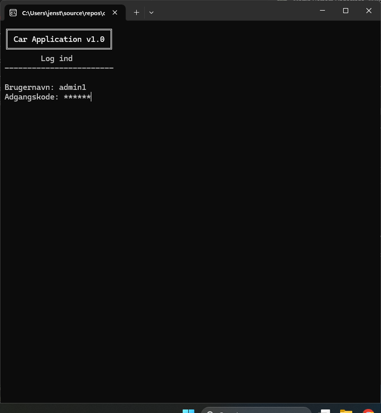
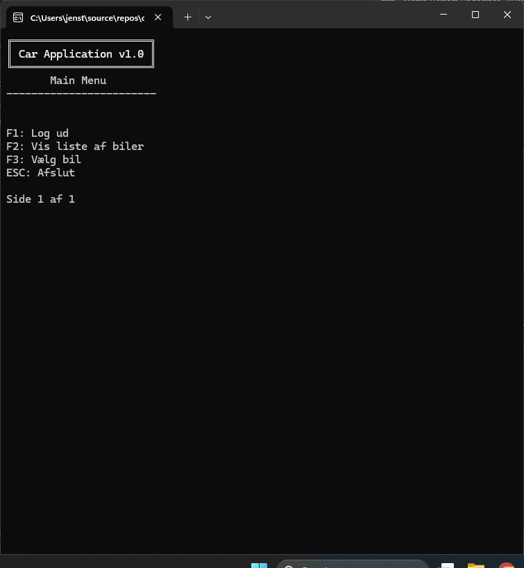
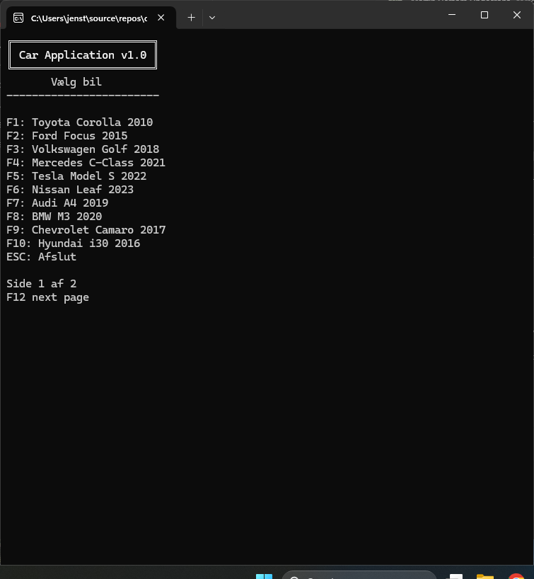
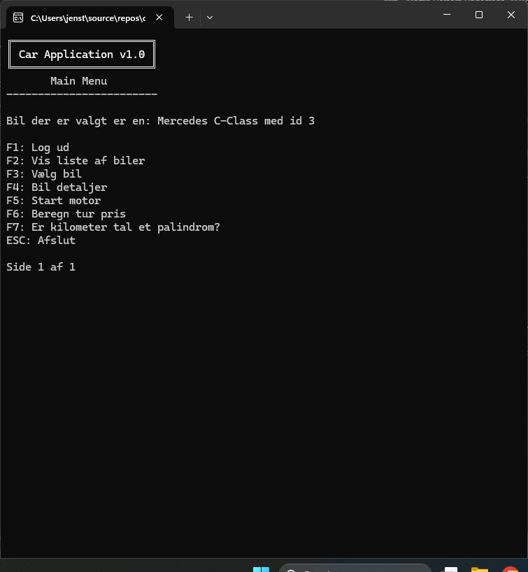
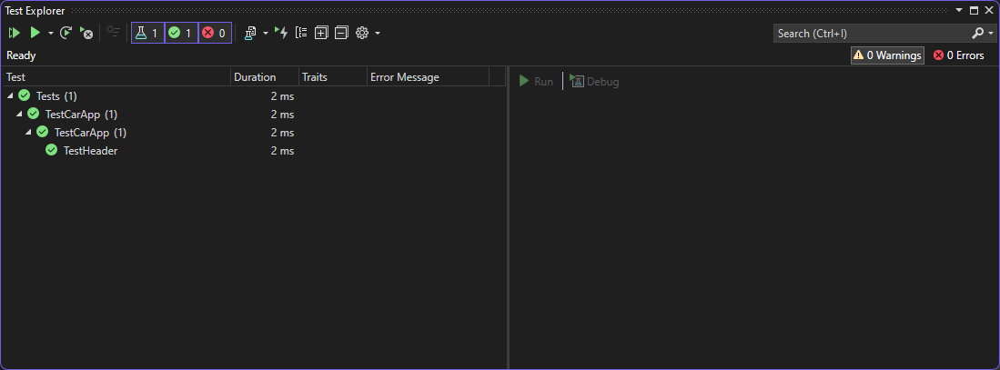

[![Contributors][contributors-shield]][contributors-url]
[![Forks][forks-shield]][forks-url]
[![Stargazers][stars-shield]][stars-url]
[![Issues][issues-shield]][issues-url]
[![MIT License][license-shield]][license-url]
[![LinkedIn][linkedin-shield]][linkedin-url]

<br />
<div align="center">
    <a href="https://github.com/TirsvadDatamatiker/CarApp">
        
    </a>
    <h3 align="center">CarApp</h3>
    <p align="center">
    A car application as assignment for the course "Datamatiker" at UCL
    <br />
    <br />
    <!-- PROJECT SCREENSHOTS -->
    <a href="https://github.com/TirsvadDatamatiker/CarApp/blob/master/images/Screenshot_login.png">
        
    </a>
    <a href="https://github.com/TirsvadDatamatiker/CarApp/blob/master/images/Screenshot_mainMenu.png">
        
    </a>
    <a href="https://github.com/TirsvadDatamatiker/CarApp/blob/master/images/Screenshot_selectCar.png">
        
    </a>
    <a href="https://github.com/TirsvadDatamatiker/CarApp/blob/master/images/Screenshot_MainMenu2.png">
        
    </a>    
    <br />
    <a href="https://github.com/TirsvadDatamatiker/CarApp"><strong>Explore the docs »</strong></a>
    <br />
    <br />
    <a href="https://github.com/TirsvadDatamatiker/CarApp/issues/new?labels=bug&template=bug-report---.md">Report Bug</a>
    <a href="https://github.com/TirsvadDatamatiker/CarApp/issues/new?labels=enhancement&template=feature-request---.md">Request Feature</a>
    </p>
</div>

# CarApp

A car application as assignment for the course "Datamatiker" at UCL

## Table of Contents

- [CarApp](#carapp)
  - [Prepare Sqlite](#prepare-sqlite)
  - [Features](#features)
  - [Todo](#todo)
  - [Known issues](#known-issues)
  - [Folder Structure](#folder-structure)
  - [Class Diagram](#class-diagram)
  - [Testing](#testing)
    - [Result](#result)

## About The Project

This project is a car registration app that allows users to register their cars and view the cars that are already registered. The app is built using .NET for Console. The app is built as a part of the course DMOoF25 at UCL.

## Getting Started

To get a local copy up and running follow these simple steps.

### Prerequisites

This is an example of how to list things you need to use the software and how to install them.

- .NET 9.0
    ```
    https://dotnet.microsoft.com/download/dotnet/9.0
    ```

- Visual Studio 2022
    ```
    https://visualstudio.microsoft.com/
    ```

### Build and Run

1. Clone the repo
    ```
    git clone git@github.com:TirsvadDatamatiker/CarApp.git
    ```

2. Open the project in Visual Studio 2022

3. Build the project

4. Run the project

5. Login with the following credentials
    ```
    Username: admin1
    Password: admin1
    ```
    or
    ```
    Username: user1
    Password: user1
    ```

You may need to remove / change key bindings ´F11´ in the VS buildin terminal to use the application properly.

## Features

- [x] Add car
- [x] Calculate trip fuel price
- [x] Print rapport of car
- [x] Authentication
- [x] Export / Import json data
- [x] Add owner for each car

## Todo

- [ ] Load / Save car to database
- [ ] Clear Database

## Known issues

- [X] When returned from database menu, then main menu title missing first letter. Temporary fix wrtting a char to console before clear.
- [ ] When import and export json give user info about the process

## Folder Structure

```sh
./logo/             #Contains the logo of the project.
./documentation/    #Contains the documentation for the project.
./images/           #Contains images used in the documentation.
./CarApp/           #Contains the source code for the project.
./Tests/            #Contains the test code for the project.
```

## Class Diagram

View the class diagram [here](documentation/DCD.svg)

<a href="https://github.com/TirsvadDatamatiker/CarApp/blob/master/documentation/DCD.svg">
    
</a>


## Doxygen

To generate the doxygen documentation run the following command in the root of the project
```sh
doxygen Doxyfile
```

## Testing

### Result

<a href="https://github.com/TirsvadDatamatiker/CarApp/blob/master/images/Screenshot_testResult.png">
    
</a>

<!-- MARKDOWN LINKS & IMAGES -->
[contributors-shield]: https://img.shields.io/github/contributors/TirsvadDatamatiker/CarApp?style=for-the-badge
[contributors-url]: https://github.com/TirsvadDatamatiker/CarApp/graphs/contributors
[forks-shield]: https://img.shields.io/github/forks/TirsvadDatamatiker/CarApp?style=for-the-badge
[forks-url]: https://github.com/TirsvadDatamatiker/CarApp/network/members
[stars-shield]: https://img.shields.io/github/stars/TirsvadDatamatiker/CarApp?style=for-the-badge
[stars-url]: https://github.com/TirsvadDatamatiker/CarApp/stargazers
[issues-shield]: https://img.shields.io/github/issues/TirsvadDatamatiker/CarApp?style=for-the-badge
[issues-url]: https://github.com/TirsvadDatamatiker/CarApp/issues
[license-shield]: https://img.shields.io/github/license/TirsvadDatamatiker/CarApp?style=for-the-badge
[license-url]: https://github.com/TirsvadDatamatiker/CarApp/blob/master/LICENSE
[linkedin-shield]: https://img.shields.io/badge/-LinkedIn-black.svg?style=for-the-badge&logo=linkedin&colorB=555
[linkedin-url]: https://www.linkedin.com/in/jens-tirsvad-nielsen-13b795b9/
